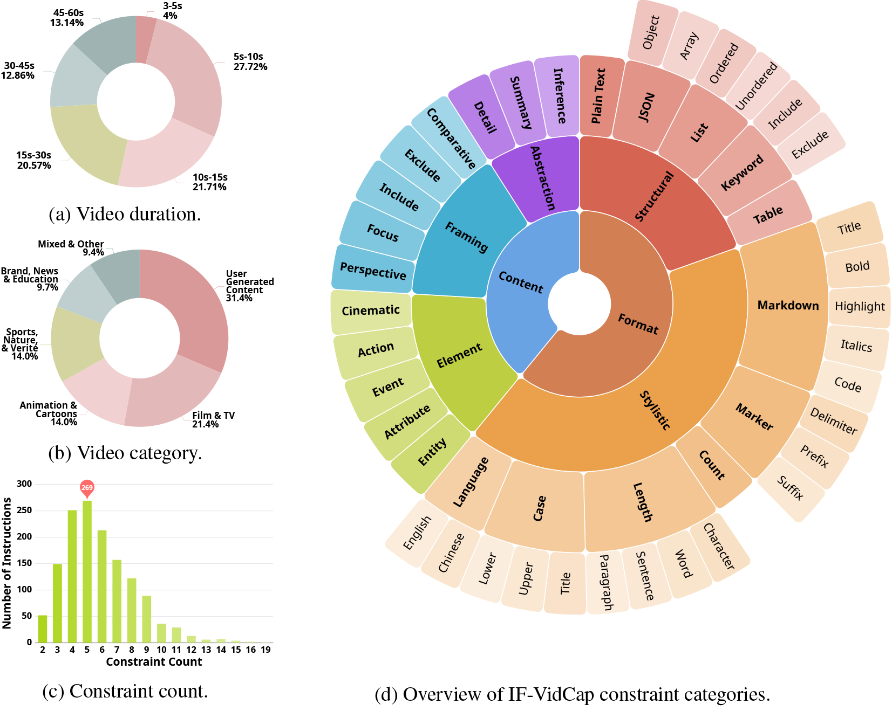

<div align="center">
  <h1>
    <br>
    IF-VidCap:<br>
    Can Video Caption Models Follow Instructions?
  </h1>
  
  <p align="center">
    <a href="https://github.com/NJU-LINK/IF-VidCap"></a>
    <a href="https://arxiv.org/abs/YOUR_PAPER_ID"></a>
    <a href="https://if-vidcap.github.io/"></a>
    <a href="https://huggingface.co/datasets/YOUR_USERNAME/IF-VidCap"></a>
    <a href="YOUR_DEMO_LINK"></a>
  </p>

  <p align="center">
    <a href="README.md">English</a> | <a href="README_zh.md">中文</a>
  </p>
</div>

---

## 📋 Abstract

Although Multimodal Large Language Models (MLLMs) have demonstrated proficiency in video captioning, practical applications require captions that follow specific user instructions rather than generating exhaustive, unconstrained descriptions. Current benchmarks, however, primarily assess descriptive comprehensiveness while largely overlook instruction-following capabilities. 

To address this gap, we introduce **IF-VidCap**, a new benchmark for evaluating controllable video captioning, which contains 1,400 high-quality samples. Distinct from existing video captioning or general instruction-following benchmarks, IF-VidCap incorporates a systematic framework that assesses captions on two dimensions: **format correctness** and **content correctness**.

<p align="center">
  
  <br>
  <em>Figure 1: Differences in Controlled Video Captioning Capabilities among MLLMs</em>
</p>

## 🌟 Key Features

- **🎯 First Instruction-Following Video Captioning Benchmark**: 1,400 complex, compositional instructions aligned with real-world downstream applications
- **🔍 Robust Evaluation Protocol**: Multi-dimensional evaluation combining rule-based and LLM-based checks
- **📊 Comprehensive Analysis**: Evaluation of 20+ state-of-the-art models with detailed insights
- **📚 Training Dataset**: Curated dataset for fine-grained instruction-based control

<p align="center">
  
  <br>
  <em>Figure 2: Sample data in IF-VidCap. Our checklist is divided into two types based on the checking method: rule-based items checked by LLM with rule scripts and open-ended items checked by LLM. The rule-based items cover format correctness, while the open-ended items cover semantic and content correctness.</em>
</p>

## 📈 Benchmark Statistics

<p align="center">
  
</p>

- **Video Duration**: Average 20.5s (ranging from 3s to 60s)
- **Constraint Types**: 27 distinct types across 6 categories
- **Average Constraints**: 6 per instruction
- **Video Categories**: 13+ diverse categories including Film & TV, Animation, Sports, Nature, etc.

## 🚀 Quick Start

### Installation

```bash
git clone https://github.com/NJU-LINK/IF-VidCap.git
cd IF-VidCap
pip install -r requirements.txt
```

### Download Dataset

#### Using Hugging Face Datasets

```python
from datasets import load_dataset

# Load the benchmark dataset
benchmark_dataset = load_dataset("YOUR_USERNAME/IF-VidCap", name="benchmark")

# Load the training dataset (optional)
training_dataset = load_dataset("YOUR_USERNAME/IF-VidCap", name="training")

# Access samples
sample = benchmark_dataset['test'][0]
print(sample['instruction'])
print(sample['video_path'])
```

#### Using Git LFS

```bash
# Clone with Git LFS
git lfs install
git clone https://huggingface.co/datasets/YOUR_USERNAME/IF-VidCap

# Or use huggingface-cli
huggingface-cli download YOUR_USERNAME/IF-VidCap --local-dir ./IF-VidCap --local-dir-use-symlinks False
```

### Evaluation

```python
from ifvidcap import IFVidCapEvaluator
from datasets import load_dataset

# Initialize evaluator
evaluator = IFVidCapEvaluator()

# Load dataset from Hugging Face
dataset = load_dataset("YOUR_USERNAME/IF-VidCap", name="benchmark")

# Load your model predictions
predictions = load_predictions("path/to/predictions.json")

# Run evaluation
results = evaluator.evaluate(predictions, dataset)
print(results)
```

## 🤗 Hugging Face Dataset Structure

```
IF-VidCap/
├── benchmark/
│   ├── videos/           # Video files
│   ├── instructions.json # Instructions and constraints
│   └── checklists.json   # Evaluation checklists
└── training/
    ├── videos/           # Training video files
    └── annotations.json  # Training annotations
```

### Dataset Card

Visit our [Hugging Face Dataset Page](https://huggingface.co/datasets/YOUR_USERNAME/IF-VidCap) for:
- 📊 Detailed dataset statistics
- 📝 Data format specifications
- 🔍 Example viewer
- 📄 License information

## 📊 Benchmark Results

### Overall Performance

| Model | Params | Overall ISR | Overall CSR | Rule-based ISR | Rule-based CSR | Open-ended ISR | Open-ended CSR |
|-------|--------|-------------|-------------|----------------|----------------|----------------|----------------|
| **Closed-Source Models** |
| Gemini-2.5-Pro | - | 27.83 | 74.53 | 74.35 | 87.81 | 35.22 | 59.00 |
| GPT-4o | - | 22.90 | 70.74 | 69.20 | 85.12 | 30.94 | 53.91 |
| **Open-Source Models** |
| Qwen3-VL-72B | 72B | 26.41 | 71.65 | 67.16 | 84.14 | 36.39 | 57.12 |
| InternVL-3.5 | 241B | 24.20 | 71.17 | 65.58 | 83.21 | 34.64 | 57.13 |
| Qwen2.5-VL-32B | 32B | 15.16 | 64.04 | 53.66 | 76.95 | 26.72 | 48.94 |
| **IF-Captioner-Qwen (Ours)** | 7B | **12.76** | **61.64** | **58.50** | **78.81** | **19.65** | **41.56** |

*ISR: Instruction Satisfaction Rate, CSR: Constraint Satisfaction Rate*

### Key Findings

1. 📈 **Performance scales with model size** within the same family
2. 🏆 **Top open-source models now rival closed-source** counterparts
3. 🧠 **Reasoning capabilities are crucial** for complex instruction-following
4. 📝 **Format control is easier than content control** across all models

## 🛠️ Training Your Own Model
### 🚧 Training Dataset (Coming Soon)
We are preparing to release our training dataset on Hugging Face. The dataset contains:
- 11K curated video-caption pairs
- 46K video-instruction-response triplets
- Diverse instruction types covering all 27 constraint categories
**Expected release date**: Coming soon! Follow our [Hugging Face page](https://huggingface.co/datasets/YOUR_USERNAME/IF-VidCap) for updates.


## 📝 Citation

If you find our work useful, please cite:

```bibtex

```

## 🤝 Contributing

We welcome contributions! Please see our [Contributing Guidelines](CONTRIBUTING.md) for details.

## 📄 License

This project is licensed under the [MIT License](LICENSE).

## 📧 Contact

For questions and feedback:
- 🐛 Issues: [GitHub Issues](https://github.com/yourusername/IF-VidCap/issues)
- 💬 Discussions: [Hugging Face Discussions](https://huggingface.co/datasets/YOUR_USERNAME/IF-VidCap/discussions)
- 📧 Email: [contact@example.com](mailto:contact@example.com)

