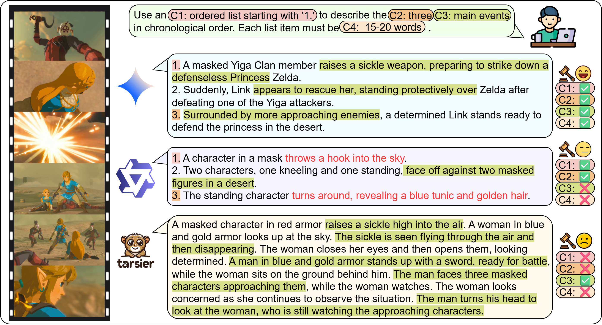

<div align="center">
  <h1>
    <br>
    IF-VidCap: 视频描述模型能否遵循指令？
    
  </h1>
  
  <p align="center">
    <a href="README.md">English</a> | <a href="README_zh.md">中文</a>
  </p>
  
  <p align="center">
    <a href="https://github.com/NJU-LINK/IF-VidCap"></a>
    <a href="https://arxiv.org/abs/YOUR_PAPER_ID"></a>
    <a href="https://if-vidcap.github.io"></a>
    <a href="https://huggingface.co/datasets/YOUR_USERNAME/IF-VidCap"></a>
    <a href="YOUR_DEMO_LINK"></a>
  </p>
</div>

---

## 📋 摘要

尽管多模态大型语言模型（MLLMs）在视频描述方面表现出色，但实际应用需要描述能够遵循特定的用户指令，而不是生成详尽的、无约束的描述。然而，当前的基准测试主要评估描述的全面性，而在很大程度上忽略了指令遵循能力。

为了解决这一问题，我们引入了**IF-VidCap**，这是一个用于评估可控视频描述的新基准，包含1,400个高质量样本。与现有的视频描述或通用指令遵循基准不同，IF-VidCap采用了一个系统框架，从两个维度评估描述：**格式正确性**和**内容正确性**。

<p align="center">
  
  <br>
  <em>图1：不同MLLMs在受控视频描述能力上的差异</em>
</p>

## 🌟 主要特点

- **🎯 首个指令遵循视频描述基准**：1,400个与实际下游应用对齐的复杂组合指令
- **🔍 稳健的评估协议**：结合基于规则和基于LLM检查的多维度评估
- **📊 全面分析**：对20+个最先进模型的评估，提供详细见解
- **📚 训练数据集**：为细粒度基于指令的控制精心策划的数据集

<p align="center">
  
  <br>
  <em>图2：IF-VidCap中的示例数据。我们的检查清单根据检查方法分为两种类型：通过LLM结合规则脚本检查的基于规则项，以及由LLM检查的开放式项。基于规则项涵盖格式正确性，而开放式项则涵盖语义和内容正确性。</em>
</p>

## 📈 基准统计

<p align="center">
  
</p>

- **视频时长**：平均20.5秒（3秒到60秒）
- **约束类型**：6个类别中的27种不同类型
- **平均约束数**：每个指令6个
- **视频类别**：13+种多样化类别，包括电影电视、动画、体育、自然等

## 🚀 快速开始

### 安装

```bash
git clone https://github.com/NJU-LINK/IF-VidCap.git
cd IF-VidCap
pip install -r requirements.txt
```

### 下载数据集

#### 使用 Hugging Face Datasets

```python
from datasets import load_dataset

# 加载基准数据集
benchmark_dataset = load_dataset("YOUR_USERNAME/IF-VidCap", name="benchmark")

# 加载训练数据集（可选）
training_dataset = load_dataset("YOUR_USERNAME/IF-VidCap", name="training")

# 访问样本
sample = benchmark_dataset['test'][0]
print(sample['instruction'])
print(sample['video_path'])
```

#### 使用 Git LFS

```bash
# 使用 Git LFS 克隆
git lfs install
git clone https://huggingface.co/datasets/YOUR_USERNAME/IF-VidCap

# 或使用 huggingface-cli
huggingface-cli download YOUR_USERNAME/IF-VidCap --local-dir ./IF-VidCap --local-dir-use-symlinks False
```

### 评估

```python
from ifvidcap import IFVidCapEvaluator
from datasets import load_dataset

# 初始化评估器
evaluator = IFVidCapEvaluator()

# 从 Hugging Face 加载数据集
dataset = load_dataset("YOUR_USERNAME/IF-VidCap", name="benchmark")

# 加载模型预测
predictions = load_predictions("path/to/predictions.json")

# 运行评估
results = evaluator.evaluate(predictions, dataset)
print(results)
```

## 🤗 Hugging Face 数据集结构

```
IF-VidCap/
├── benchmark/
│   ├── videos/           # 视频文件
│   ├── instructions.json # 指令和约束
│   └── checklists.json   # 评估清单
└── training/
    ├── videos/           # 训练视频文件
    └── annotations.json  # 训练标注
```

### 数据集卡片

访问我们的 [Hugging Face 数据集页面](https://huggingface.co/datasets/YOUR_USERNAME/IF-VidCap) 了解：
- 📊 详细的数据集统计
- 📝 数据格式规范
- 🔍 示例查看器
- 📄 许可证信息

## 📊 基准结果

### 总体性能

| 模型 | 参数量 | 总体ISR | 总体CSR | 规则ISR | 规则CSR | 开放ISR | 开放CSR |
|------|--------|---------|---------|---------|---------|---------|---------|
| **闭源模型** |
| Gemini-2.5-Pro | - | 27.83 | 74.53 | 74.35 | 87.81 | 35.22 | 59.00 |
| GPT-4o | - | 22.90 | 70.74 | 69.20 | 85.12 | 30.94 | 53.91 |
| **开源模型** |
| Qwen3-VL-72B | 72B | 26.41 | 71.65 | 67.16 | 84.14 | 36.39 | 57.12 |
| InternVL-3.5 | 241B | 24.20 | 71.17 | 65.58 | 83.21 | 34.64 | 57.13 |
| Qwen2.5-VL-32B | 32B | 15.16 | 64.04 | 53.66 | 76.95 | 26.72 | 48.94 |
| **IF-Captioner-Qwen (我们的)** | 7B | **12.76** | **61.64** | **58.50** | **78.81** | **19.65** | **41.56** |

*ISR：指令满足率，CSR：约束满足率*

### 主要发现

1. 📈 **性能随模型大小增长**（同系列内）
2. 🏆 **顶级开源模型现已媲美闭源模型**
3. 🧠 **推理能力对复杂指令遵循至关重要**
4. 📝 **格式控制比内容控制更容易**（所有模型均如此）

## 🛠️ 训练您自己的模型

### 🚧 训练数据集（即将发布）

我们正准备在 Hugging Face 上发布训练数据集。该数据集包含：
- 11K 精心策划的视频-描述对
- 46K 视频-指令-响应三元组
- 涵盖所有27种约束类别的多样化指令类型

**预计发布日期**：即将发布！请关注我们的 [Hugging Face 页面](https://huggingface.co/datasets/YOUR_USERNAME/IF-VidCap) 获取更新。

## 📝 引用

如果您觉得我们的工作有用，请引用：

```bibtex

```

## 🤝 贡献

欢迎贡献！请查看我们的[贡献指南](CONTRIBUTING.md)了解详情。

## 📄 许可证

本项目采用[MIT许可证](LICENSE)。

## 📧 联系方式

如有问题和反馈：
- 🐛 问题：[GitHub Issues](https://github.com/yourusername/IF-VidCap/issues)
- 💬 讨论：[Hugging Face Discussions](https://huggingface.co/datasets/YOUR_USERNAME/IF-VidCap/discussions)
- 📧 邮箱：[contact@example.com](mailto:contact@example.com)
